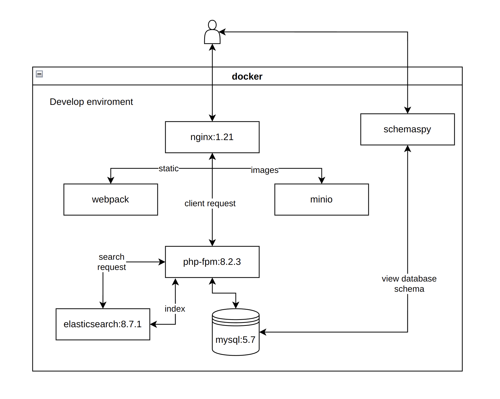

### Описание проекта

Проект создавал для себя в 2019 году для проверки каких-то теорий, развития и наработки практики разработки, тематика проекта не особо важна для этого. В последствии монетизирован. 
Периодически возвращаюсь, когда узнаю что-то новое или нужно опять же проверить для применения на работе.

Много времени уделяю качеству проекта:

1. придерживаюсь архитектуры [Porto](https://github.com/Mahmoudz/Porto)
2. вся инфраструктура изолирована в docker
3. написаны тесты на phpunit и laravel dusk
4. автоформатирование кода к стандарту PSR-12
5. код актуализируется через phprector
6. проверки в github actions после каждой отправки
   1. phpstan
   2. phprector
   3. ecs (php-cs-fixer)
7. периодически включаю Php CodeSniffer (под ecs)
8. production окружение обвязано мониторингом и алертами в telegram
9. стараюсь обновлять приложение до последних версий php и библиотек (тесты позволяют меньше беспокоиться о проблемах после обновления).

Детально описана только архитектура среды разработки, так как раскрытие production окружения чревато последующими возможными проблемами с безопасностью.

### Содержание репозитория

1. Директория .github (github actions проверки качества кода phpstan, rector, ecs (php-cs-fixer))
2. Директория docker (dockerfile прода и среды разработки)
3. Директория www - исходный код приложения
   1. app/Containers - модули приложения
      1. Tests - тесты модуля
      2. Tasks - мелкие программные единицы с единственной ответственностью
      3. Actions - композиция тасков
   2. app/Ship - общие/родительские классы для модулей и глобальные обработчики
4. docker-compose.yml - локальная среда разработки
5. code style (файлы phpstorm_codestyle.xml и .editorconfig - PSR-12 с небольшими изменениями)
6. jenkins/Jenkinsfile
   1. Сборка приложения
   2. Отправка в docker registry
   3. Обновление образа в docker-swarm

### Технологический стек

- backend
  - php 8.2
  - laravel 10
  - модульная архитектура Laravel Modules на базе [Porto](https://github.com/Mahmoudz/Porto)
- frontend
  - javascript + jquery components
  - webpack 5, gulp
- infrastructure
  - elasticsearch
  - minio
  - mysql 5.7
  - docker-swarm (production), docker-compose (develop)
  - fpm + nginx
  - jenkins (self hosted)
  - docker hub (self hosted)
  - verdaccio (self hosted)
  - alerting (prometheus, grafana, etc) (self hosted)
  - redmine (self hosted)

### Окружение разработки

#### Быстрые ссылки 

1. http://127.0.0.1:8111 - app
2. http://127.0.0.1:8112 - minio
3. http://127.0.0.1:8113 - schemaspy 